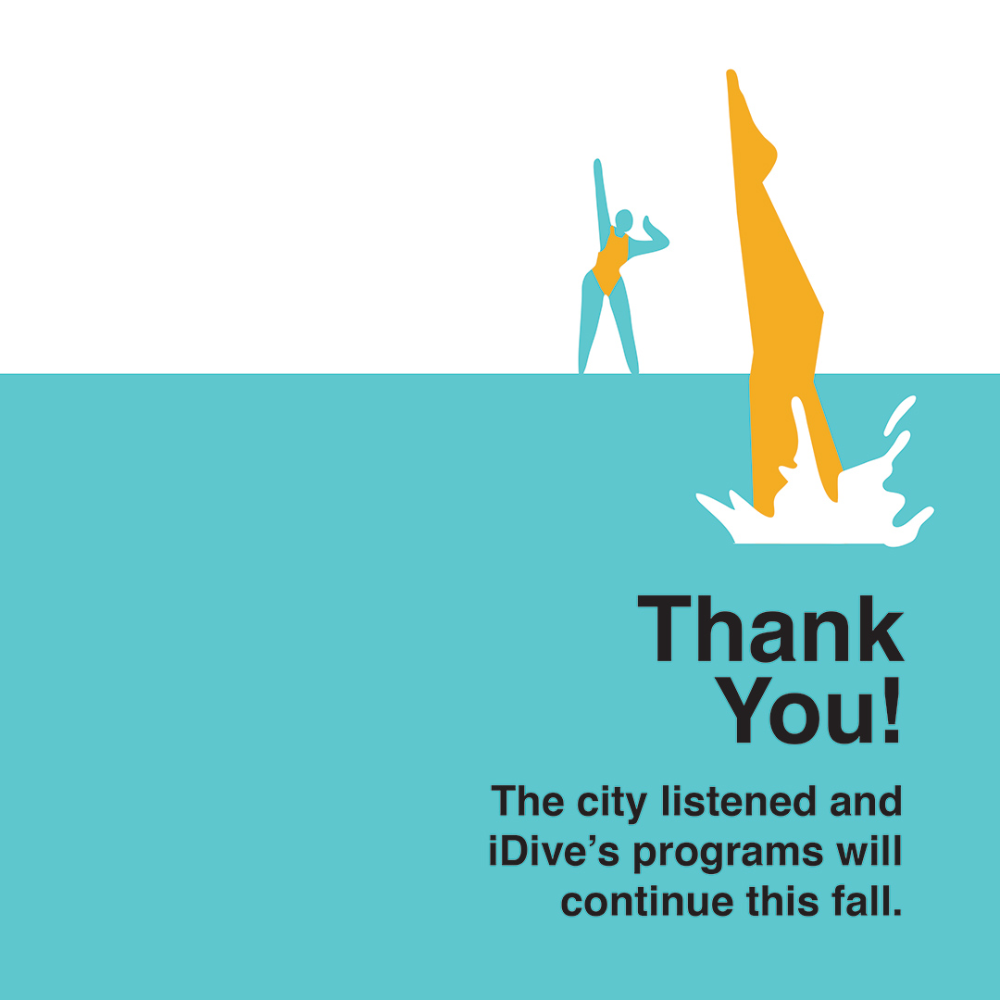
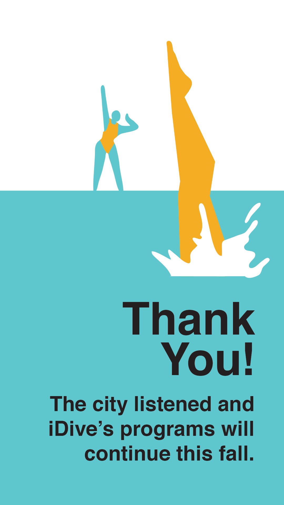
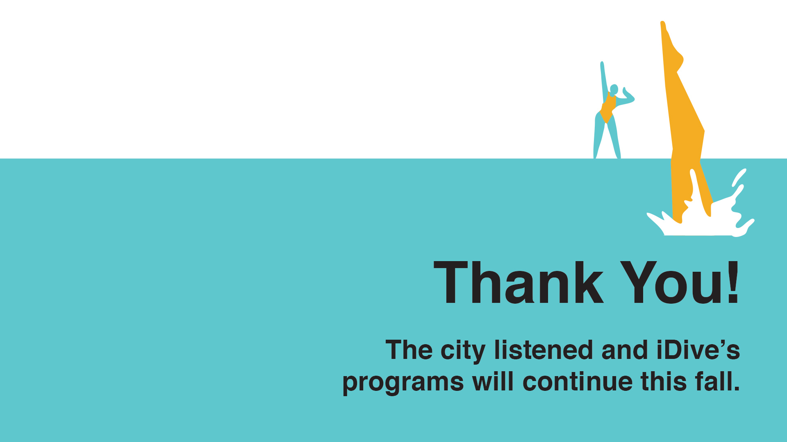
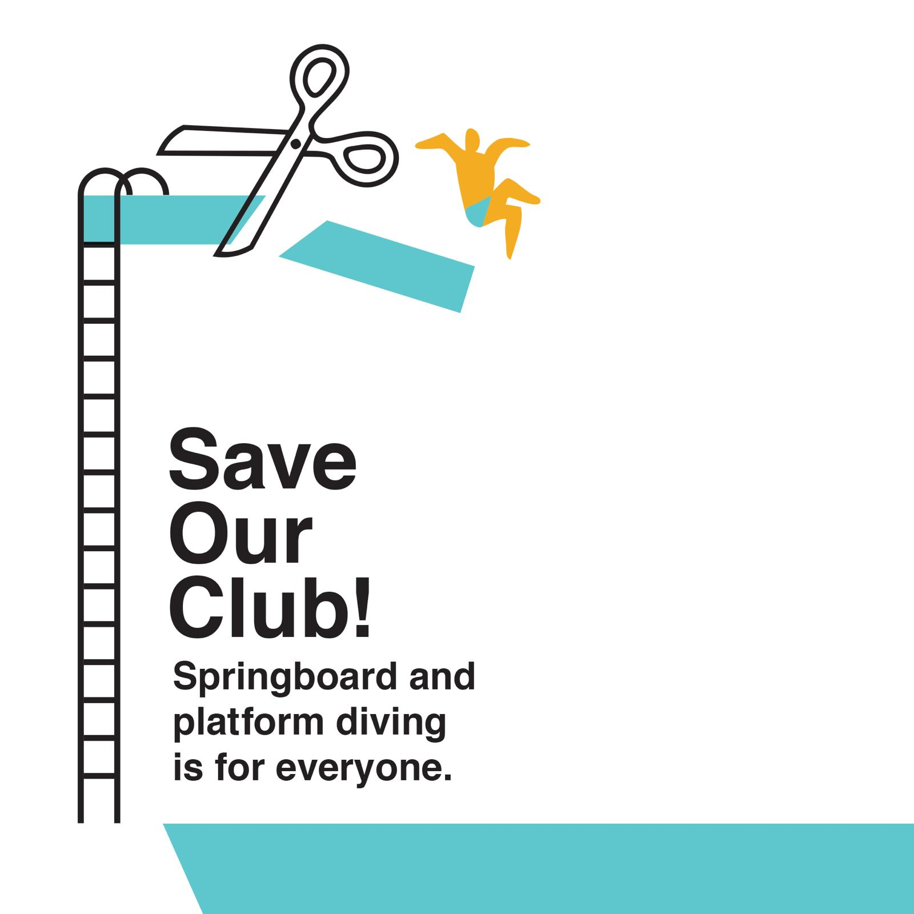
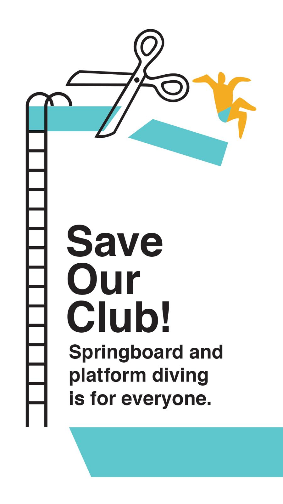

## We did it!

Congrats to everyone who helped make this campaign a huge success! If you would
like to post to your social media followers that we made it and that we're so grateful
for their support, check out the images below!

## Hashtag

The hashtag for this campaign is: **#saveidive**

## Messaging

It seems that we have more success when a post feels personal. Make it personal
that you're losing your diving program!

[This post](https://www.instagram.com/reel/C9mXSbARjLF/?utm_source=ig_web_button_share_sheet&igsh=MzRlODBiNWFlZA==) seems
to have some decent traction on it. The description is as follows:

> These are the vibes we're about to lose. This is a moment from the masters training session yesterday. Watch it a couple times. Listen to what's being said. We're conquering our fears and refining our technique. We're supporting each other. We're divers from our early 20's to our mid 40's in this clip. Beginners to experts. It's fantastic, and painful, and scary... And we're learning as a team, together.
>
> We're gonna lose this if the VAC schedule changes go through. Please sign the petition! 👉🏼 Link in my bio
>
> #saveidive #canadianmastersdiving #mastersdiving #dpc

To add a link to your bio, follow [these steps](https://help.instagram.com/362497417173378/?cms_platform=android-app&helpref=platform_switcher).

## Images

Large social media poster image

Small social media poster image

